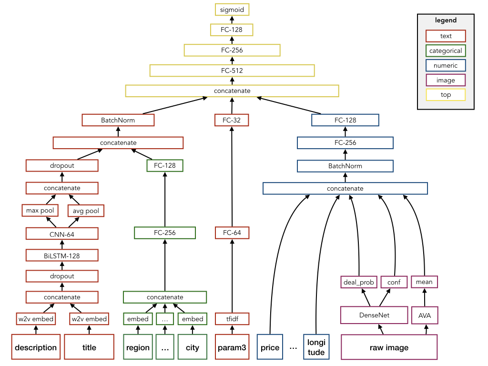

# kaggle competition: Avito demand prediction

This repository is a collection of models and scripts used for the 24th-place solution of the avito demand prediction challenge hosted on kaggle

### Todos:
- add explanation -> ensemble of LGB + NN
- add model scripts
- add ensemble script
- add section about feature engineering

### Neural Network Architecture

Dependencies:
- trained w2v
- trained DenseNet161
- features from AVA

Used features:
- a
- b
- c

### Gradient boosting Model

-> used lightgbm

Used features:
- a
- b
- c

### Feature Engineering

##### text
- #words
- #caps
- #digits
- #spaces
- #punctuation

##### simple model predictions
- ridge1
- ridge2
- ridge price

##### periods

##### image

##### regional
Supplemental region information from wikipedia

- time zone
- population density
- population
- rural
- urban

##### geo coordinates

- longitude
- latitude